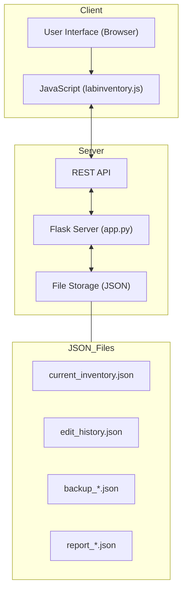
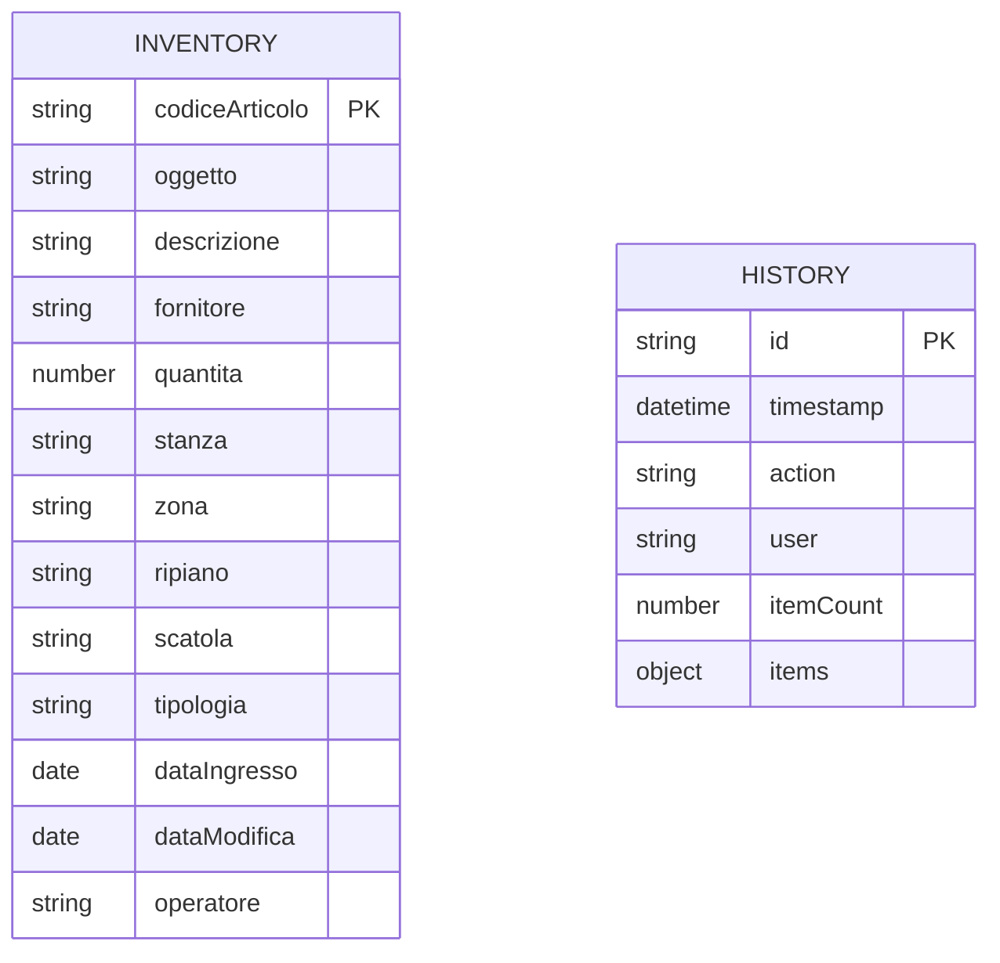

# Laboratory Inventory System

A web application for laboratory inventory management that allows tracking items, locations, and quantities.

<div align="center">
  
  
  
  
</div>

## Table of Contents

- [Features](#features)
- [Technologies Used](#technologies-used)
- [Requirements](#requirements)
- [Installation](#installation)
- [Project Structure](#project-structure)
- [Usage](#usage)
- [Application Architecture](#application-architecture)
- [API Endpoints](#api-endpoints)
- [System Usage](#system-usage)
- [Deployment](#deployment)
- [Troubleshooting](#troubleshooting)

## Features

- View, add, edit, and delete items
- Filter by type, supplier, room, area, shelf, box, and quantity
- Global search with exact match option
- Import data from TXT files (tabular format)
- Export data in TSV format
- Automatic JSON report generation during imports
- Persistent data storage in JSON files
- Complete logging of all inventory changes
- Automatic data backup before each modification
- Responsive interface with zoom options for the table
- Automatic synchronization between multiple devices

## Technologies Used

| Category | Technologies |
|-----------|------------|
| **Frontend** | HTML5, CSS3, JavaScript, Bootstrap 5, DataTables, jQuery, Flatpickr |
| **Backend** | Flask (Python 3.7+), Werkzeug |
| **Storage** | JSON files with change tracking |
| **Deployment** | Nginx/Apache, Gunicorn |

## Requirements

- Python 3.7 or higher
- Flask 2.3.3
- Werkzeug 2.3.7
- Modern web browser with JavaScript support

## Installation

1. Clone the repository:
   ```bash
   git clone https://github.com/GrennMilo/Lab_Inventory.git
   cd Lab_Inventory
   ```

2. Install dependencies:
   ```bash
   pip install -r requirements.txt
   ```

3. Launch the application:
   ```bash
   python app.py
   ```

4. Open your browser and navigate to `http://localhost:5000`

## Project Structure

```
Lab Inventory/
├── app.py                  # Main Flask application
├── requirements.txt        # Python dependencies
├── .gitignore              # Git configuration file
├── static/                 # Static files
│   ├── css/
│   │   └── labinventory.css # Stylesheets
│   └── js/
│       └── labinventory.js  # JavaScript logic
├── templates/
│   └── labinventory.html   # Main HTML template
├── reports/                # Directory for JSON data (gitignored)
│   ├── current_inventory.json  # Main inventory file
│   ├── edit_history.json       # Change history log
│   └── ...                     # Reports generated from imports
└── README.md               # Documentation
```

## Usage

### Adding Items

1. Click the "Enable Edit" button to activate edit mode
2. Click the "Add Item" button
3. Fill out the form with item details
4. Click "Save"

### Importing Data

1. Click the "Import TXT" button
2. Drag a TXT file or click "Select File"
3. Verify the data preview
4. Click "Confirm Import"
5. A JSON report will be automatically generated in the "reports" folder

### Exporting Data

1. Click the "Export TSV" button to download the data in tabular format

### Filters and Search

- Use the filters in the top section to filter items by category
- Use the search bar to search for text in any field

### Saving Changes

Changes are automatically saved in two cases:
1. When modifying a single item, by pressing Enter or moving to another field
2. When disabling edit mode (the "Disable Edit" button)

All changes are recorded in the `edit_history.json` file with details on:
- Date and time of the change
- Type of change (add, edit, delete)
- User who made the change
- Details of the modified items

### Multi-device Access

The inventory is accessible from multiple devices simultaneously. All devices display the same updated data, saved in JSON files on the server.

## Application Architecture

The application follows a client-server architecture with the following main components:



The data flow is organized as follows:
1. The client requests data via REST API
2. The server loads data from JSON files
3. The user interacts with the interface and modifies data
4. Changes are sent to the server via REST API
5. The server saves changes, creates backups, and records history

### Backend Components

The Flask backend handles the following functionalities:

| Component | Function |
|------------|----------|
| **REST API** | Handles HTTP requests from the client |
| **Inventory Manager** | Loads and saves inventory data |
| **Backup System** | Creates backups before each modification |
| **Tracking System** | Records all changes in the history file |
| **Report Manager** | Generates and serves reports in JSON format |

### Frontend Components

The frontend is built with the following technologies and components:

| Component | Technology | Function |
|------------|------------|----------|
| **Inventory Table** | DataTables | Display and interaction with data |
| **Edit Form** | Bootstrap 5 | Adding and editing items |
| **Filters** | DataTables + Custom JS | Multi-criteria data filtering |
| **TXT Import** | JavaScript | Loading and parsing TXT files |
| **TSV Export** | DataTables | Exporting data in tabular format |

## API Endpoints

| Endpoint | Method | Description | Parameters | Response |
|----------|--------|-------------|-----------|----------|
| `/api/health` | GET | Check application status | - | `{"status": "ok", "message": "..."}` |
| `/api/inventory` | GET | Get all inventory data | - | `{"items": [...]}` |
| `/api/inventory` | POST | Update all inventory data | `{"items": [...]}` | `{"status": "success", "message": "..."}` |
| `/api/inventory/item` | POST | Add a new item | `{item object}` | `{"status": "success", "item": {...}}` |
| `/api/inventory/item/<id>` | PUT | Update an existing item | `{item object}` | `{"status": "success", "item": {...}}` |
| `/api/inventory/item/<id>` | DELETE | Delete an item | - | `{"status": "success", "message": "..."}` |
| `/api/history` | GET | Get the edit history | - | `{"edits": [...]}` |
| `/api/save-report` | POST | Save report from import | `{"items": [...], "filename": "..."}` | `{"status": "success", "filepath": "..."}` |
| `/reports` | GET | List of available reports | - | `{"reports": [...]}` |
| `/reports/<filename>` | GET | Download a specific report | - | JSON Content |

## System Usage

### Login and Access Control

Currently, the application uses a username-based authentication system, which is saved as the operator's identifier to track changes. To implement a complete login system:

1. Access the main page of the application
2. Enter your username when prompted
3. The username will be saved and associated with all changes made

### Basic Operations

The application supports the following basic operations:

1. **View inventory**:
   - Access the main page to view all items
   - Use filters to narrow the view
   - Change the zoom level with the dedicated selector

2. **Add a new item**:
   - Activate edit mode with the "Enable Edit" button
   - Click "Add Item"
   - Fill out the form with item details
   - Click "Save"

3. **Edit an existing item**:
   - Activate edit mode
   - Click directly on the cell to edit or
   - Use the edit button in the "Actions" column
   - Make changes and save

4. **Delete an item**:
   - Activate edit mode
   - Click the delete button in the "Actions" column
   - Confirm the deletion in the dialog box

5. **Import data from TXT file**:
   - Click "Import TXT"
   - Drag a TXT file into the dedicated area or select it via browser
   - Check the data preview
   - Click "Confirm Import"

### Data Structure

The inventory data structure follows this schema:



## Deployment

### System Requirements

To run the application in production, you need:

- Python 3.7 or higher
- Flask 2.3.3 or higher
- A web server (Nginx or Apache) for the production environment
- At least 100 MB of disk space for the application and JSON files
- Network connection for multi-device access

### Production Configuration

To configure the application in a production environment:

1. **Install dependencies**:
   ```bash
   pip install -r requirements.txt
   pip install gunicorn
   ```

2. **Web server configuration**:
   For Nginx, add a server block:
   ```nginx
   server {
       listen 80;
       server_name labinventory.example.com;
       
       location / {
           proxy_pass http://127.0.0.1:5000;
           proxy_set_header Host $host;
           proxy_set_header X-Real-IP $remote_addr;
       }
   }
   ```

3. **Start the application with WSGI**:
   ```bash
   gunicorn -w 4 -b 127.0.0.1:5000 app:app
   ```

4. **Configure a systemd service**:
   Create a file `/etc/systemd/system/labinventory.service`:
   ```ini
   [Unit]
   Description=Lab Inventory Flask Application
   After=network.target

   [Service]
   User=www-data
   WorkingDirectory=/path/to/lab-inventory
   ExecStart=/usr/local/bin/gunicorn -w 4 -b 127.0.0.1:5000 app:app
   Restart=always

   [Install]
   WantedBy=multi-user.target
   ```

   Activate the service:
   ```bash
   sudo systemctl enable labinventory
   sudo systemctl start labinventory
   ```

### Performance and Security

| Aspect | Recommendation |
|---------|-----------------|
| **Backup** | Configure daily backups external to the application directory |
| **SSL/TLS** | Implement HTTPS with Let's Encrypt for secure connections |
| **Authentication** | Implement a complete login system for multi-user environments |
| **Rate Limiting** | Configure request limits to prevent API abuse |
| **Monitoring** | Use tools like Prometheus/Grafana to monitor the application |

## Troubleshooting

### Common Issues

| Problem | Solution |
|----------|-----------|
| **Data loading error** | Check JSON file permissions in the `reports/` directory |
| **Synchronization not working** | Verify all devices are connected to the same network |
| **Slow performance** | Reduce JSON file size by deleting old backups |
| **Application crash** | Check the logs in `/var/log/labinventory/app.log` |

### Support Contacts

For technical assistance, contact:
- Email: support@labinventory.example.com
- Phone: +39 0123 456789
- Hours: Mon-Fri 9:00-18:00

---

## Contributing to the Project

Contributions are welcome! To contribute:

1. Fork the repository
2. Create a branch for your feature (`git checkout -b feature/NewFeature`)
3. Commit your changes (`git commit -m 'Add NewFeature'`)
4. Push the branch (`git push origin feature/NewFeature`)
5. Open a Pull Request

## License

This project is distributed under the MIT license. See the `LICENSE` file for more details.

---

<div align="center">
  <p>© 2025 Lab Inventory System</p>
</div> 