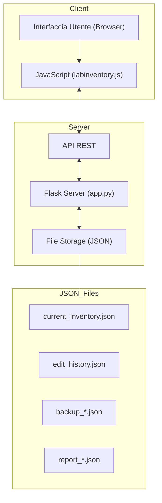
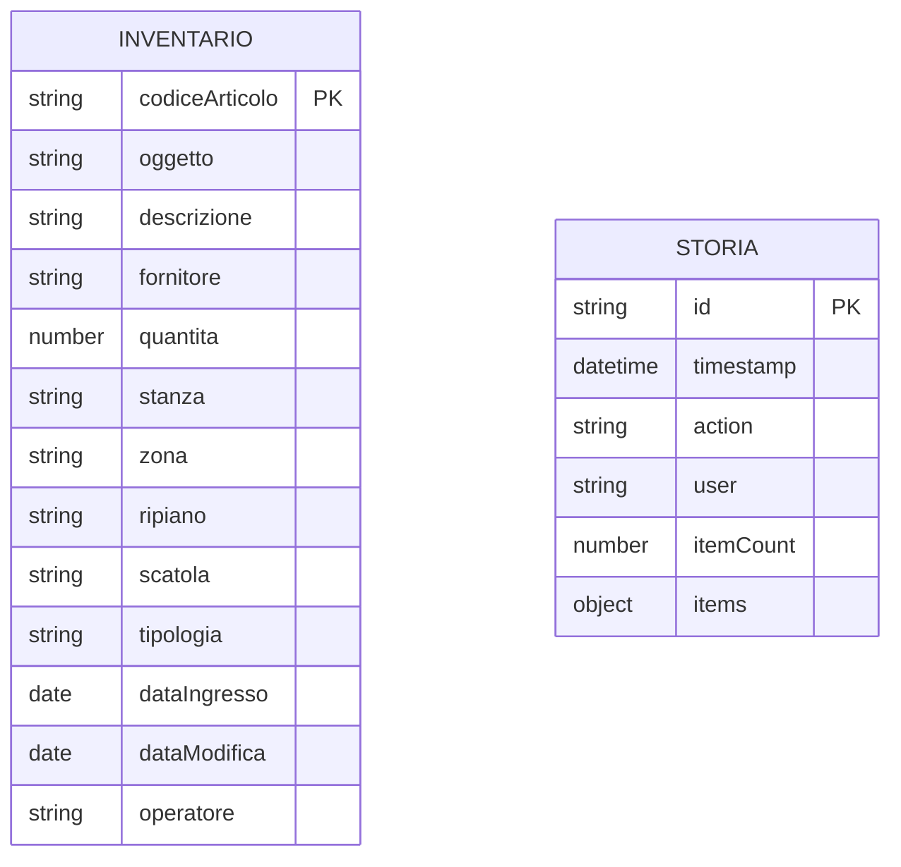

# Laboratory Inventory System

Un'applicazione web per la gestione dell'inventario di laboratorio, che consente di tracciare articoli, posizioni e quantità.

<div align="center">
  
  
  
  
</div>

## Indice dei Contenuti

- [Funzionalità](#funzionalità)
- [Tecnologie Utilizzate](#tecnologie-utilizzate)
- [Requisiti](#requisiti)
- [Installazione](#installazione)
- [Struttura del Progetto](#struttura-del-progetto)
- [Utilizzo](#utilizzo)
- [Architettura dell'Applicazione](#architettura-dellapplicazione)
- [API Endpoints](#api-endpoints)
- [Utilizzo del Sistema](#utilizzo-del-sistema)
- [Deployment](#deployment)
- [Risoluzione dei Problemi](#risoluzione-dei-problemi)

## Funzionalità

- Visualizzazione, aggiunta, modifica ed eliminazione di articoli
- Filtri per tipologia, fornitore, stanza, zona, ripiano, scatola e quantità
- Ricerca globale con opzione di corrispondenza esatta
- Importazione dati da file TXT (formato tabulare)
- Esportazione dati in formato TSV
- Generazione automatica di report JSON durante l'importazione
- Salvataggio persistente dei dati su file JSON
- Registrazione completa di tutte le modifiche all'inventario
- Backup automatico dei dati prima di ogni modifica
- Interfaccia responsive con opzioni di zoom per la tabella
- Sincronizzazione automatica tra dispositivi multipli

## Tecnologie Utilizzate

| Categoria | Tecnologie |
|-----------|------------|
| **Frontend** | HTML5, CSS3, JavaScript, Bootstrap 5, DataTables, jQuery, Flatpickr |
| **Backend** | Flask (Python 3.7+), Werkzeug |
| **Storage** | File JSON con tracking delle modifiche |
| **Deployment** | Nginx/Apache, Gunicorn |

## Requisiti

- Python 3.7 o superiore
- Flask 2.3.3
- Werkzeug 2.3.7
- Browser web moderno con supporto JavaScript

## Installazione

1. Clona il repository:
   ```bash
   git clone https://github.com/GrennMilo/Lab_Inventory.git
   cd Lab_Inventory
   ```

2. Installa le dipendenze:
   ```bash
   pip install -r requirements.txt
   ```

3. Avvia l'applicazione:
   ```bash
   python app.py
   ```

4. Apri il browser e naviga a `http://localhost:5000`

## Struttura del Progetto

```
Lab Inventory/
├── app.py                  # Applicazione Flask principale
├── requirements.txt        # Dipendenze Python
├── .gitignore              # File di configurazione Git
├── static/                 # File statici
│   ├── css/
│   │   └── labinventory.css # Fogli di stile
│   └── js/
│       └── labinventory.js  # Logica JavaScript
├── templates/
│   └── labinventory.html   # Template HTML principale
├── reports/                # Directory per i dati JSON (gitignored)
│   ├── current_inventory.json  # File principale dell'inventario
│   ├── edit_history.json       # Storico delle modifiche
│   └── ...                     # Report generati dalle importazioni
└── README.md               # Documentazione
```

## Utilizzo

### Aggiunta di Articoli

1. Clicca sul pulsante "Abilita Modifica" per attivare la modalità di modifica
2. Clicca sul pulsante "Aggiungi Articolo"
3. Compila il modulo con i dettagli dell'articolo
4. Clicca su "Salva"

### Importazione di Dati

1. Clicca sul pulsante "Importa TXT"
2. Trascina un file TXT o clicca su "Seleziona File"
3. Verifica l'anteprima dei dati
4. Clicca su "Conferma Import"
5. Un report JSON sarà automaticamente generato nella cartella "reports"

### Esportazione di Dati

1. Clicca sul pulsante "Esporta TSV" per scaricare i dati in formato tabulare

### Filtri e Ricerca

- Utilizza i filtri nella sezione superiore per filtrare gli articoli per categoria
- Utilizza la barra di ricerca per cercare testo in qualsiasi campo

### Salvataggio delle Modifiche

Le modifiche vengono salvate automaticamente in due casi:
1. Quando si modifica un singolo articolo, premendo Invio o passando a un altro campo
2. Quando si disabilita la modalità modifica (pulsante "Disabilita Modifica")

Tutte le modifiche vengono registrate nel file `edit_history.json` con dettagli su:
- Data e ora della modifica
- Tipo di modifica (aggiunta, modifica, eliminazione)
- Utente che ha effettuato la modifica
- Dettagli degli articoli modificati

### Accesso Multi-dispositivo

L'inventario è accessibile da più dispositivi contemporaneamente. Tutti i dispositivi visualizzano gli stessi dati aggiornati, salvati nei file JSON sul server.

## Architettura dell'Applicazione

L'applicazione segue un'architettura client-server con i seguenti componenti principali:



Il flusso di dati è organizzato come segue:
1. Il client richiede i dati tramite API REST
2. Il server carica i dati dai file JSON
3. L'utente interagisce con l'interfaccia e modifica i dati
4. Le modifiche vengono inviate al server tramite API REST
5. Il server salva le modifiche, crea backup e registra la cronologia

### Componenti del Backend

Il backend Flask gestisce le seguenti funzionalità:

| Componente | Funzione |
|------------|----------|
| **API REST** | Gestisce le richieste HTTP dal client |
| **Gestore Inventario** | Carica e salva i dati dell'inventario |
| **Sistema di Backup** | Crea backup prima di ogni modifica |
| **Sistema di Tracking** | Registra tutte le modifiche nel file di storia |
| **Gestore Report** | Genera e serve i report in formato JSON |

### Componenti del Frontend

Il frontend è costruito con le seguenti tecnologie e componenti:

| Componente | Tecnologia | Funzione |
|------------|------------|----------|
| **Tabella Inventario** | DataTables | Visualizzazione e interazione con i dati |
| **Form di Modifica** | Bootstrap 5 | Aggiunta e modifica degli articoli |
| **Filtri** | DataTables + Custom JS | Filtro multi-criterio dei dati |
| **Importazione TXT** | JavaScript | Caricamento e parsing di file TXT |
| **Esportazione TSV** | DataTables | Esportazione dei dati in formato tabulare |

## API Endpoints

| Endpoint | Metodo | Descrizione | Parametri | Risposta |
|----------|--------|-------------|-----------|----------|
| `/api/health` | GET | Verifica lo stato dell'applicazione | - | `{"status": "ok", "message": "..."}` |
| `/api/inventory` | GET | Ottieni tutti i dati dell'inventario | - | `{"items": [...]}` |
| `/api/inventory` | POST | Aggiorna tutti i dati dell'inventario | `{"items": [...]}` | `{"status": "success", "message": "..."}` |
| `/api/inventory/item` | POST | Aggiungi un nuovo articolo | `{oggetto articolo}` | `{"status": "success", "item": {...}}` |
| `/api/inventory/item/<id>` | PUT | Aggiorna un articolo esistente | `{oggetto articolo}` | `{"status": "success", "item": {...}}` |
| `/api/inventory/item/<id>` | DELETE | Elimina un articolo | - | `{"status": "success", "message": "..."}` |
| `/api/history` | GET | Ottieni lo storico delle modifiche | - | `{"edits": [...]}` |
| `/api/save-report` | POST | Salva report da importazione | `{"items": [...], "filename": "..."}` | `{"status": "success", "filepath": "..."}` |
| `/reports` | GET | Lista dei report disponibili | - | `{"reports": [...]}` |
| `/reports/<filename>` | GET | Scarica un report specifico | - | Contenuto JSON |

## Utilizzo del Sistema

### Login e Controllo Accessi

Al momento l'applicazione utilizza un sistema di autenticazione basato su username, che viene salvato come identificativo dell'operatore per tracciare le modifiche. Per implementare un sistema di login completo:

1. Accedere alla pagina principale dell'applicazione
2. Inserire il proprio nome utente quando richiesto
3. Il nome utente verrà salvato e associato a tutte le modifiche apportate

### Operazioni Base

L'applicazione supporta le seguenti operazioni di base:

1. **Visualizzazione dell'inventario**:
   - Accedere alla pagina principale per visualizzare tutti gli articoli
   - Utilizzare i filtri per restringere la visualizzazione
   - Cambiare il livello di zoom con il selettore dedicato

2. **Aggiunta di un nuovo articolo**:
   - Attivare la modalità di modifica con il pulsante "Abilita Modifica"
   - Fare clic su "Aggiungi Articolo"
   - Compilare il modulo con i dettagli dell'articolo
   - Fare clic su "Salva"

3. **Modifica di un articolo esistente**:
   - Attivare la modalità di modifica
   - Fare clic direttamente sulla cella da modificare oppure
   - Utilizzare il pulsante di modifica nella colonna "Azioni"
   - Apportare le modifiche e salvare

4. **Eliminazione di un articolo**:
   - Attivare la modalità di modifica
   - Fare clic sul pulsante di eliminazione nella colonna "Azioni"
   - Confermare l'eliminazione nella finestra di dialogo

5. **Importazione dati da file TXT**:
   - Fare clic su "Importa TXT"
   - Trascinare un file TXT nell'area dedicata o selezionarlo tramite browser
   - Controllare l'anteprima dei dati
   - Fare clic su "Conferma Importazione"

### Struttura dei Dati

La struttura dei dati dell'inventario segue questo schema:



## Deployment

### Requisiti di Sistema

Per eseguire l'applicazione in produzione sono necessari:

- Python 3.7 o superiore
- Flask 2.3.3 o superiore
- Un server web (Nginx o Apache) per l'ambiente di produzione
- Almeno 100 MB di spazio su disco per l'applicazione e i file JSON
- Connessione di rete per l'accesso multi-dispositivo

### Configurazione per la Produzione

Per configurare l'applicazione in un ambiente di produzione:

1. **Installazione delle dipendenze**:
   ```bash
   pip install -r requirements.txt
   pip install gunicorn
   ```

2. **Configurazione del server web**:
   Per Nginx, aggiungere un blocco server:
   ```nginx
   server {
       listen 80;
       server_name labinventory.example.com;
       
       location / {
           proxy_pass http://127.0.0.1:5000;
           proxy_set_header Host $host;
           proxy_set_header X-Real-IP $remote_addr;
       }
   }
   ```

3. **Avvio dell'applicazione con WSGI**:
   ```bash
   gunicorn -w 4 -b 127.0.0.1:5000 app:app
   ```

4. **Configurazione di un servizio systemd**:
   Creare un file `/etc/systemd/system/labinventory.service`:
   ```ini
   [Unit]
   Description=Lab Inventory Flask Application
   After=network.target

   [Service]
   User=www-data
   WorkingDirectory=/path/to/lab-inventory
   ExecStart=/usr/local/bin/gunicorn -w 4 -b 127.0.0.1:5000 app:app
   Restart=always

   [Install]
   WantedBy=multi-user.target
   ```

   Attivare il servizio:
   ```bash
   sudo systemctl enable labinventory
   sudo systemctl start labinventory
   ```

### Performance e Sicurezza

| Aspetto | Raccomandazione |
|---------|-----------------|
| **Backup** | Configurare backup giornalieri esterni alla directory dell'applicazione |
| **SSL/TLS** | Implementare HTTPS con Let's Encrypt per connessioni sicure |
| **Autenticazione** | Implementare un sistema di login completo per ambienti multi-utente |
| **Rate Limiting** | Configurare limiti di richiesta per prevenire abusi dell'API |
| **Monitoraggio** | Utilizzare strumenti come Prometheus/Grafana per monitorare l'applicazione |

## Risoluzione dei Problemi

### Problemi Comuni

| Problema | Soluzione |
|----------|-----------|
| **Errore di caricamento dati** | Verificare i permessi dei file JSON nella directory `reports/` |
| **Sincronizzazione non funzionante** | Verificare che tutti i dispositivi siano connessi alla stessa rete |
| **Performance lente** | Ridurre la dimensione dei file JSON eliminando vecchi backup |
| **Crash dell'applicazione** | Controllare i log in `/var/log/labinventory/app.log` |

### Contatti per Supporto

Per assistenza tecnica contattare:
- Email: support@labinventory.example.com
- Telefono: +39 0123 456789
- Orari: Lun-Ven 9:00-18:00

---

## Contribuire al Progetto

Le contribuzioni sono benvenute! Per contribuire:

1. Fai un fork del repository
2. Crea un branch per la tua funzionalità (`git checkout -b feature/NuovaFunzionalità`)
3. Fai commit delle tue modifiche (`git commit -m 'Aggiungi NuovaFunzionalità'`)
4. Pusha il branch (`git push origin feature/NuovaFunzionalità`)
5. Apri una Pull Request

## Licenza

Questo progetto è distribuito con licenza MIT. Vedi il file `LICENSE` per maggiori dettagli.

---

<div align="center">
  <p>© 2025 Lab Inventory System</p>
</div> 